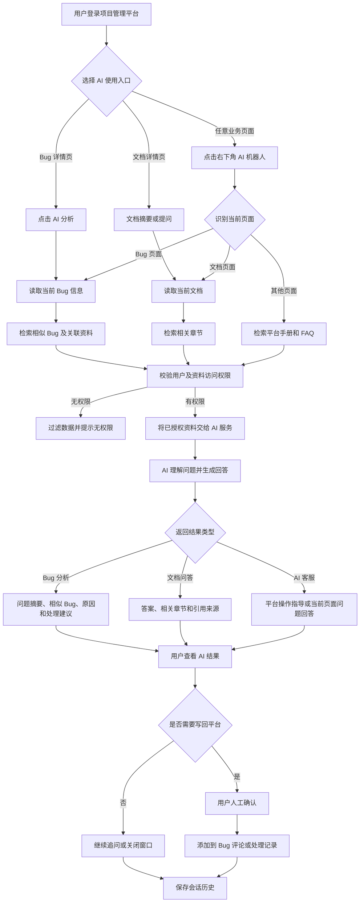
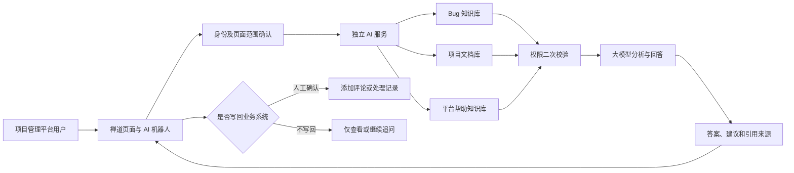

# AI 服务客户展示流程图

版本：v1.0  
日期：2026-07-10  
文档类型：客户沟通材料  
适用范围：项目方案介绍、客户需求沟通、AI 服务流程说明

## 1. 方案概述

本方案在现有项目管理平台基础上增加独立 AI 服务，为用户提供 Bug 智能分析、文档问答和全局 AI 客服能力。

项目管理平台继续负责用户、项目、流程、权限和业务数据；AI 服务负责知识检索、内容分析和回答生成。AI 在使用业务资料前必须经过权限校验，涉及写回业务系统的操作必须由用户人工确认。

## 2. AI 服务总体业务流程

## 3. 系统关系简图

## 4. 三类主要使用场景

### 4.1 Bug 智能分析

用户在 Bug 详情页发起 AI 分析后，系统读取当前 Bug，检索用户有权访问的相似 Bug 和关联资料，并输出：

- 问题摘要和规范化复现步骤。
- 相似 Bug 及历史处理经验。
- 可能原因和建议处理方法。
- 优先级、严重程度和风险提示。
- 可追溯的资料来源。

AI 结果默认只展示。需要添加到 Bug 评论或处理记录时，由用户确认后执行。

### 4.2 文档摘要与问答

用户可以在文档详情页生成摘要或针对当前文档提问。AI 只检索当前用户有权访问的资料，回答时展示相关章节和来源链接；资料不足时明确提示未找到依据。

### 4.3 全局 AI 客服

登录后的业务页面右下角显示机器人图标，用户不需要离开当前页面即可打开聊天窗口：

- Bug 页面围绕当前 Bug 和授权关联资料回答。
- 文档页面围绕当前文档回答。
- 其他页面只回答平台操作手册、FAQ 和使用说明。
- 支持流式回答、连续追问、引用来源和历史会话恢复。

## 5. 权限与安全控制

AI 服务遵循“先校验权限，再使用资料”的原则：

1. 禅道服务端根据当前登录用户和页面路由生成可信上下文。
2. AI 服务检索可能相关的候选资料。
3. 候选资料进入大模型前，再由禅道逐个确认访问权限。
4. 无权限、权限不明确或权限服务不可用的数据默认不使用。
5. 用户失去对象权限后，对应历史回答和引用也不再展示。
6. AI 不自动关闭 Bug、不自动修改状态、不自动发布版本。
7. 涉及写回平台的操作必须经过用户人工确认。

## 6. 客户价值

- 减少重复 Bug 排查和历史经验查找时间。
- 提高项目文档的检索与复用效率。
- 让用户在任意业务页面快速获得操作指导。
- 在保留现有项目流程和权限体系的前提下接入 AI。
- AI 回答尽量提供引用来源，便于用户核实。
- AI 服务异常时不影响原有项目管理功能。

## 7. 客户沟通说明

可以向客户概括为：

> 用户可以在 Bug、文档以及其他业务页面直接使用 AI。系统会根据当前页面自动限定 AI 的查询范围，并在调用 AI 前通过项目管理平台重新检查用户权限。AI 输出的问题分析、文档答案和操作指导尽量附带资料来源；涉及修改业务数据时，必须由用户人工确认，AI 不会自动关闭问题或修改项目状态。

## 8. 首批交付范围

首批 MVP 包含：

- Bug 相似检索与 AI 分析。
- 单文档摘要与问答。
- 全局 AI 机器人入口和聊天弹窗。
- `help`、`bug`、`doc` 三种聊天范围。
- 流式回答、历史消息和引用来源。
- 对象级权限校验和人工确认机制。

项目级跨对象问答、客户反馈自动分类、项目风险周报和通用推荐安排在后续版本实现。
