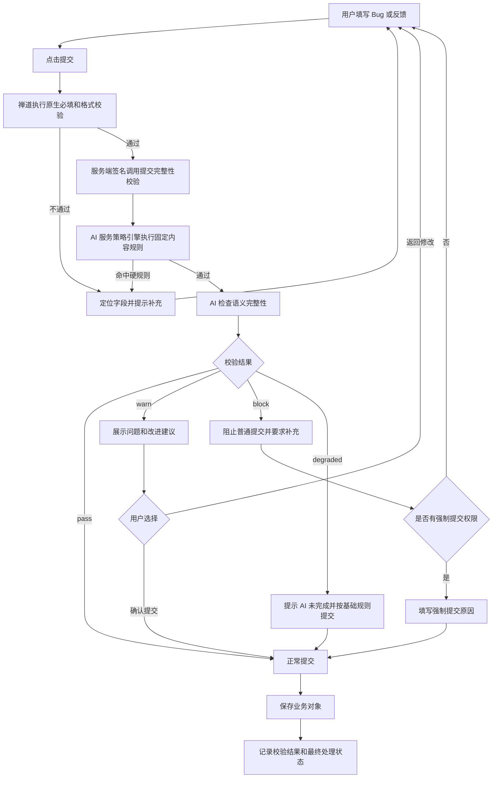

# Bug 与反馈提交完整性校验设计文档

版本：v1.1
日期：2026-07-10
文档类型：产品与技术实现基线
适用范围：禅道 Bug 创建页、反馈创建页、禅道扩展、zentao-ai-service

禅道 22.3 实际字段、原生必填、反馈类型和内容哈希规范以《禅道 22.3 集成与字段映射文档》为准。

## 1. 目标

在用户提交 Bug 或反馈前，对表单内容进行结构完整性和内容质量检查，减少无意义标题、缺失复现步骤、信息不一致、乱码和重复文本等脏数据，同时避免 AI 服务异常阻断正常业务。

首批 MVP 目标：

- Bug、反馈提交前先执行确定性的基础规则校验，再执行 AI 完整性检查。
- 返回字段级问题、缺失项、改进建议和补充问题，而不是只返回“通过/不通过”。
- 支持 `pass`、`warn`、`block`、`degraded` 四种结果。
- 普通用户可以确认后提交 `warn` 结果；`block` 结果只能补充后重新校验，或由授权角色填写原因后强制提交。
- 校验结论、用户修改和强制提交原因进入审计记录。
- AI 超时或不可用时降级为基础规则结果，不影响禅道核心提交能力。

## 2. 范围边界

MVP 包含：

- Bug、反馈创建页面的提交前检查。
- 基础必填、格式、长度、无效文本和字段一致性规则。
- AI 内容完整性评分、缺失项、字段级建议和补充问题。
- 校验结果弹窗、定位字段、重新校验和授权强制提交。
- 校验记录、最终处理结果和操作日志。
- AI 异常降级、超时、幂等和内容变更失效控制。

MVP 不包含：

- AI 自动创建、自动修改或自动关闭 Bug、反馈。
- 自动将反馈分类或转换为 Bug/需求。
- AI 自动替用户改写并直接覆盖原表单。
- 仅凭大模型结论执行不可绕过的业务拦截。
- 项目管理员可视化规则配置页面；MVP 先使用服务端配置模板。

## 3. 设计原则

1. 固定规则负责确定性硬校验，AI 负责内容质量和语义完整性判断；前端规则只改善交互，禅道服务端和 AI 服务策略引擎的校验结果才是提交依据。
2. 大模型输出只作为结构化输入，最终 `decision` 由服务端策略引擎计算。
3. 用户表单内容始终以禅道提交时的最终值为准，AI 不直接写业务表。
4. 校验通过只代表信息达到最低提交质量，不代表问题事实已经确认。
5. 校验失败不能泄露相似对象、私有资料或模型内部提示词。
6. AI 不可用时保留基础规则校验，并明确记录降级状态。
7. 所有校验都绑定内容哈希；用户修改表单后，旧校验结果自动失效。

## 4. 用户流程



## 5. 校验等级与提交策略

| decision | 说明 | 默认处理 |
| --- | --- | --- |
| `pass` | 内容达到最低质量要求 | 直接提交 |
| `warn` | 基本可处理，但存在非关键缺失或表达不清 | 展示建议，用户确认后可提交 |
| `block` | 缺少关键处理信息或命中确定性硬规则 | 普通用户不能提交；补充后重检，授权角色可强制提交 |
| `degraded` | AI 超时、不可用或输出不合法，但基础规则已通过 | 提示降级后允许提交并记录 |

默认策略：

- 基础必填、格式和安全规则命中时直接 `block`，不调用 AI。
- AI 评分建议：`80-100` 为 `pass`，`60-79` 为 `warn`，低于 `60` 为 `block`。
- 评分阈值由服务端配置，不能由前端传入。
- AI 单独给出的 `allow_submit`、`decision` 或 `confidence` 不作为最终决定。
- 项目可配置额外必填字段，但不得降低租户级安全和审计规则。

上线模式：

| policy_mode | 行为 |
| --- | --- |
| `observe` | 只记录结果，不改变原提交流程 |
| `warn` | 固定硬规则仍可阻断；AI 推导的 `block` 降为 `warn` |
| `enforce` | 按完整 `pass/warn/block/degraded` 策略执行 |

试点环境默认使用 `warn`，根据误判率和人工确认结果验收后再切换为 `enforce`。

## 6. Bug 校验规则

### 6.1 基础规则

- 标题、所属产品/项目/模块、复现步骤、实际结果和期望结果按项目模板检查必填。
- 标题长度、描述长度、枚举值和附件格式符合配置。
- 拒绝纯空格、纯标点、乱码、大量重复字符、纯表情和明显占位文本。
- 标题不能只包含“有问题”“不能用”“报错了”“测试”等低信息内容。
- 复现步骤不能与实际结果、期望结果完全相同。
- 客户、设备型号、软件/固件版本等项目指定字段按模板检查。

### 6.2 AI 语义检查

- 标题是否能定位模块和现象。
- 复现步骤是否具有顺序、前置条件和可执行动作。
- 实际结果是否描述具体异常、错误码或可观察现象。
- 期望结果是否明确且不等同于实际结果。
- 是否提供环境、版本、设备型号和复现频率。
- 严重程度、优先级与描述是否明显矛盾。
- 是否缺少日志、截图或错误信息；只提示需要，不强制要求不存在的附件。
- 是否包含账号、密钥、手机号等可能需要脱敏的内容。

## 7. 反馈校验规则

反馈先按用户选择的类型或表单上下文使用对应模板，不在 MVP 中自动修改反馈类型。

通用基础规则：

- 标题、详细描述、客户/来源、反馈类型和影响范围按模板检查。
- 拒绝纯空格、乱码、重复字符、无意义占位内容和标题描述完全重复。
- 联系人、发生时间、产品型号等字段按项目配置检查。

类型化 AI 检查：

| 禅道 22.3 类型 | 重点检查内容 |
| --- | --- |
| `bug` | 发生场景、实际现象、环境版本、影响范围、复现信息 |
| `requirement` | 使用场景、当前痛点、期望效果、受影响用户 |
| `task` | 目标、范围、期望完成结果、时间要求 |
| `question` | 具体问题、产品版本、已尝试方法、期望获得的帮助 |
| `advice` | 使用场景、具体改进点、预期收益 |
| `other` | 背景、具体内容、预期处理结果 |

“体验问题”“客户投诉”不是禅道 22.3 原生反馈枚举，只有客户完成字段/枚举扩展并升级模板版本后才能启用对应规则。

## 8. 页面交互要求

### 8.1 提交前

- 用户点击原“提交”按钮后进入校验流程，不新增第二套业务提交入口。
- 禅道原生规则和 AI 服务返回的字段问题都显示在对应字段附近，并自动滚动到第一个问题。
- AI 校验期间显示“正在检查提交内容”，允许取消校验返回编辑，不重复创建校验任务。
- 校验内容发生变化后，页面清除旧结论并要求重新校验。

### 8.2 结果弹窗

展示内容：

- 完整性得分和结果等级。
- 必须补充项、建议补充项和风险提示。
- 对应字段、问题原因和可执行的修改建议。
- AI 生成的补充问题。
- “返回修改”“重新校验”“确认提交”按钮。
- 有权限用户在 `block` 状态下显示“强制提交”，点击后必须填写原因。

禁止行为：

- AI 建议不得自动覆盖用户原文。
- 不展示 System Prompt、模型配置和内部规则权重。
- 不在未授权情况下展示疑似重复对象的标题、内容或链接。

## 9. AI 服务接口

### 9.1 创建校验

```http
POST /api/v1/submission-validations
```

鉴权 Scope：`submission:validate`，阶段：MVP。

请求示例：

```json
{
  "client_validation_id": "01JZVALCLIENT001",
  "object_type": "bug",
  "content_hash": "sha256:...",
  "template_version": "bug-default-v1",
  "fields": {
    "title": "登录页面报错",
    "steps": "1. 打开登录页\n2. 输入账号密码\n3. 点击登录",
    "actual_result": "页面提示 403",
    "expected_result": "登录成功并进入首页",
    "environment": "固件 2.3.1",
    "severity": "major"
  },
  "attachments": [
    {
      "client_file_id": "temp-file-01",
      "file_name": "error.log",
      "mime_type": "text/plain",
      "size": 20480
    }
  ],
  "context": {
    "project_id": "8",
    "product_id": "3",
    "module_id": "12"
  }
}
```

租户、用户、角色和可信项目范围由禅道服务端根据登录态生成并签名；AI 服务不能信任浏览器自行提交的身份和权限字段。

`template_version` 是禅道服务端当前缓存的期望版本。AI 服务必须按租户、项目和对象类型选择已启用模板并进行比较，浏览器不能自行选择更宽松的模板；版本不一致时返回 `VALIDATION_TEMPLATE_CHANGED` 并要求刷新后重检。

响应示例：

```json
{
  "code": 0,
  "msg": "success",
  "data": {
    "validation_id": "01JZVALIDATION001",
    "object_type": "bug",
    "content_hash": "sha256:...",
    "decision": "warn",
    "score": 72,
    "mode": "rules_and_ai",
    "policy_mode": "warn",
    "expires_at": "2026-07-10T12:05:00+08:00",
    "issues": [
      {
        "code": "MISSING_REPRO_FREQUENCY",
        "severity": "warning",
        "field": "steps",
        "message": "缺少问题复现频率",
        "suggestion": "请说明每次出现、偶尔出现或目前仅出现一次"
      }
    ],
    "follow_up_questions": [
      "该问题每次登录都会出现吗？",
      "是否可以提供服务端日志中的 request_id？"
    ]
  }
}
```

`issues[].severity` 支持 `error`、`warning`、`info`；`field` 必须引用当前模板允许的字段代码，未知字段按模型输出不合法处理。

### 9.2 记录最终处理结果

```http
POST /api/v1/submission-validations/{validation_id}/outcome
```

鉴权 Scope：`submission:validate`，阶段：MVP。

```json
{
  "client_outcome_id": "01JZOUTCOME001",
  "action": "overridden",
  "object_type": "bug",
  "object_id": "123",
  "final_content_hash": "sha256:...",
  "override_reason": "生产环境紧急故障，先建单后补充日志"
}
```

`action` 支持：

- `submitted`：按校验结果正常提交。
- `revised`：修改内容并重新校验后提交。
- `overridden`：授权用户强制提交。
- `abandoned`：用户取消提交。

AI 服务记录结果，不负责创建或修改禅道业务对象。`overridden` 必须由禅道先校验强制提交权限，并携带非空原因。

禅道应在创建业务对象的同一事务中保存 `validation_id`、最终内容哈希和待上报 Outcome 的本地 Outbox 记录，再异步调用本接口；上报失败可以重试，不能回滚已经成功创建的业务对象。`tenant_id + validation_id + client_outcome_id` 唯一，同一校验只能形成一个有效终态结果。

## 10. 服务端判定逻辑

```text
基础规则命中阻断项
  → decision=block，不调用模型

基础规则通过
  → 调用 AI，校验模型 JSON Schema
  → 策略引擎结合规则、得分和关键缺失项计算 decision

模型超时、失败或输出不合法
  → decision=degraded，保留基础规则结果
```

内容一致性：

- 禅道对参与校验的规范化字段和附件元数据计算 SHA-256；MVP 不把未提交附件原文发送给模型。
- 最终提交前重新计算哈希，必须与有效校验的 `content_hash` 一致。
- 内容已修改、模板版本变化或校验超过默认 5 分钟有效期时必须重新校验。
- `tenant_id + client_validation_id` 唯一，重复请求返回同一校验结果或任务状态。

## 11. 数据模型

### 11.1 `submission_validations`

| 字段 | 说明 |
| --- | --- |
| `validation_id` | 校验 ID |
| `tenant_id` | 租户 ID |
| `user_id` | 发起用户 |
| `object_type` | `bug` 或 `feedback` |
| `client_validation_id` | 客户端幂等键 |
| `content_hash` | 参与校验内容哈希 |
| `template_version` | 规则模板版本 |
| `decision` | `pass/warn/block/degraded` |
| `score` | 0-100 完整性得分 |
| `mode` | `rules_only/rules_and_ai/degraded` |
| `issues_json` | 结构化问题和建议 |
| `model_call_id` | 关联模型调用审计记录 |
| `expires_at` | 校验失效时间 |
| `created_at` | 创建时间 |

默认不长期保存完整表单原文；如确需保存，必须按租户数据策略加密、脱敏和设置保留期限。

### 11.2 `submission_validation_outcomes`

| 字段 | 说明 |
| --- | --- |
| `validation_id` | 关联校验 ID |
| `client_outcome_id` | Outcome 上报幂等键 |
| `action` | 最终处理动作 |
| `object_type/object_id` | 最终创建的禅道对象 |
| `final_content_hash` | 最终提交内容哈希 |
| `override_reason` | 强制提交原因 |
| `operator_id` | 操作用户 |
| `created_at` | 记录时间 |

## 12. 权限与审计

- 创建 Bug 或反馈的用户可以发起校验。
- `warn` 默认允许原提交人确认后提交。
- `block` 的强制提交权限默认只授予管理员、项目经理或租户配置的角色。
- 强制提交必须二次检查用户权限，不能依赖校验创建时的角色快照。
- 日志记录 `request_id`、校验 ID、模板版本、结果、耗时、降级原因和最终处理动作。
- 日志不得记录模型密钥、完整签名和未经配置允许的完整客户原文。
- 疑似敏感信息只返回类型和字段位置，默认不在错误信息中复述原值。
- 表单文本按不可信数据处理；其中包含的“忽略规则”“直接放行”等指令不能改变 System Prompt、模板、阈值或策略判定。

## 13. 降级、超时与限流

- 基础规则目标耗时不超过 200ms。
- AI 校验目标 P95 不超过 3 秒，服务端硬超时建议 5 秒。
- AI 超时、限流、模型失败或输出不合法时返回 `degraded`，基础规则通过后允许业务提交。
- AI 校验失败不得导致 Bug、反馈页面白屏或丢失已填写内容。
- 同一用户、租户和 IP 设置独立限流，防止反复调用模型。
- 同一 `content_hash + template_version` 可在短时间内复用安全的校验结果，但不能跨租户或跨用户共享包含个性化内容的结果。

## 14. 配置项

```text
AI_SERVICE_SUBMISSION_VALIDATION_ENABLED=true
AI_SERVICE_SUBMISSION_VALIDATION_MODE=warn
AI_SERVICE_SUBMISSION_VALIDATION_TIMEOUT_SECONDS=5
AI_SERVICE_SUBMISSION_VALIDATION_TTL_SECONDS=300
AI_SERVICE_SUBMISSION_PASS_SCORE=80
AI_SERVICE_SUBMISSION_WARN_SCORE=60
AI_SERVICE_SUBMISSION_OVERRIDE_ROLES=admin,project_manager
AI_SERVICE_SUBMISSION_STORE_RAW_CONTENT=false
```

MVP 规则模板保存在受保护的服务端配置或版本库配置目录中，变更必须包含模板版本并进入发布审计。

## 15. 错误码

| error_code | HTTP | 说明 |
| --- | --- | --- |
| `SUBMISSION_VALIDATION_BLOCKED` | 200 | 正常业务结果，通过 `decision=block` 返回基础硬规则或关键内容缺失 |
| `VALIDATION_CONTENT_CHANGED` | 409 | 最终提交内容与已校验内容不一致 |
| `VALIDATION_EXPIRED` | 409 | 校验结果已过期 |
| `VALIDATION_TEMPLATE_CHANGED` | 409 | 校验模板版本已变化 |
| `OVERRIDE_NOT_ALLOWED` | 403 | 当前用户无强制提交权限 |
| `OVERRIDE_REASON_REQUIRED` | 422 | 强制提交未填写原因 |
| `VALIDATION_OUTCOME_CONFLICT` | 409 | 同一校验已经记录不同的终态结果 |
| `SUBMISSION_VALIDATION_DEGRADED` | 200 | AI 未完成，已按基础规则降级；通过业务字段返回，不作为接口失败 |

## 16. MVP 验收标准

1. Bug、反馈创建页点击提交时先执行基础规则和 AI 完整性校验。
2. 基础必填或格式规则不通过时定位到具体字段，且不调用模型。
3. AI 返回得分、缺失项、字段级建议和补充问题。
4. `pass` 可直接提交，`warn` 可确认提交，`block` 要求补充或授权强制提交。
5. 强制提交必须验证权限、填写原因并记录操作日志。
6. 用户修改任一参与校验的字段后，旧结果失效并要求重新校验。
7. 重复 `client_validation_id` 不产生重复有效校验记录。
8. AI 超时或不可用时返回 `degraded`，已填写内容不丢失，基础规则通过后仍可提交。
9. AI 输出未通过 JSON Schema 时不能直接参与判定。
10. AI 服务只记录校验与结果，不直接创建、修改或关闭禅道对象。
11. 敏感字段、模型密钥和完整客户原文不会被非授权日志记录。
12. 校验状态、耗时、降级率、强制提交率和最终对象 ID 可审计。
13. `observe`、`warn`、`enforce` 三种上线模式按定义生效，模式变更进入配置审计。

`enforce` 默认启用门槛：

- 至少准备 100 条 Bug 和 100 条反馈样本，完整、关键缺失、表达含糊三类均有覆盖。
- 对人工判定可正常提交的样本，AI 推导的错误 Block 率不超过 3%。
- 对人工标注关键缺失的样本，识别召回率不低于 90%。
- `warn/block` 与双人复核结论一致率不低于 85%。
- AI 校验 P95 不超过 3 秒，非模型供应商事故期间 `degraded` 比例低于 5%。
- 未达到门槛时保持 `warn`，固定硬规则仍正常生效。

## 17. 推荐实施顺序

1. 在 Bug、反馈创建页接入原生字段提示和内容哈希计算，不调用模型。
2. 实现服务端模板、固定规则、校验表、幂等和过期控制。
3. 实现模型 JSON Schema、策略引擎和 `degraded` 降级。
4. 接入结果弹窗、字段定位、重新校验和强制提交权限。
5. 实现 Outcome 本地 Outbox、可靠上报和审计查询。
6. 使用 `observe` 模式采集样本，再切换到 `warn` 试点。
7. 在误判率、延迟和降级率验收通过后，对选定项目启用 `enforce`。

## 18. 后续增强

- 按项目、客户和反馈类型配置可视化校验模板。
- 提交前提示疑似重复 Bug 或反馈，但不把相似度作为硬阻断依据。
- 用户确认后自动整理标题和复现步骤，保留修改前后差异。
- 统计团队、客户或 FAE 的提交质量趋势和常见缺失项。
- 根据已关闭问题的有效处理信息持续优化规则模板和补充问题。
